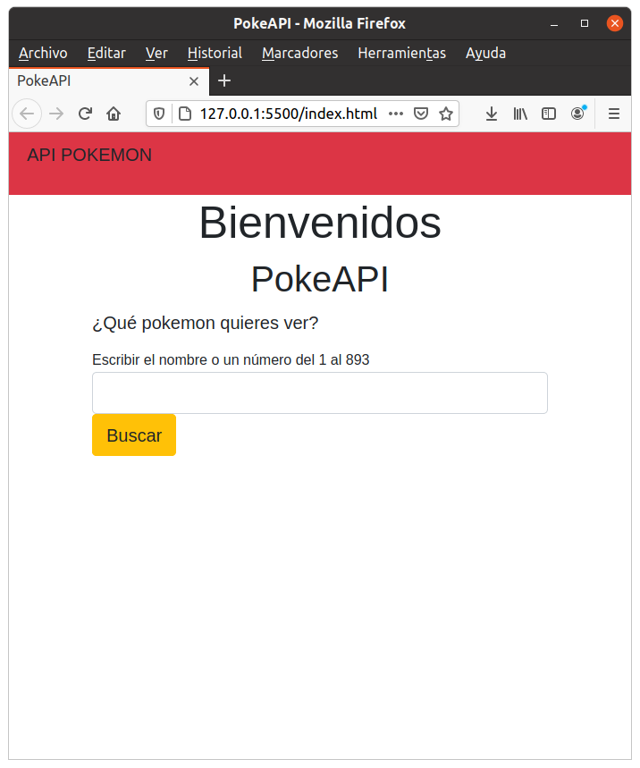
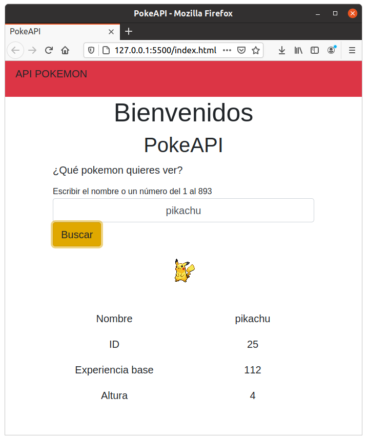
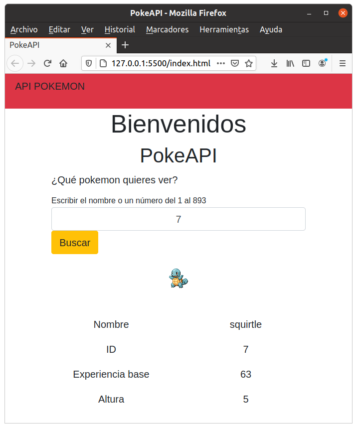

### Consumo de APIs con JS

Formas de consumir APIs:

1. Nativa JS: fetch (Esta es la que utilizamos)
2. Con la librería Axios

https://pokeapi.co/

https://pokeapi.co/api/v2/pokemon/pikachu

pikachu => nombre o número entre 1 y 893

