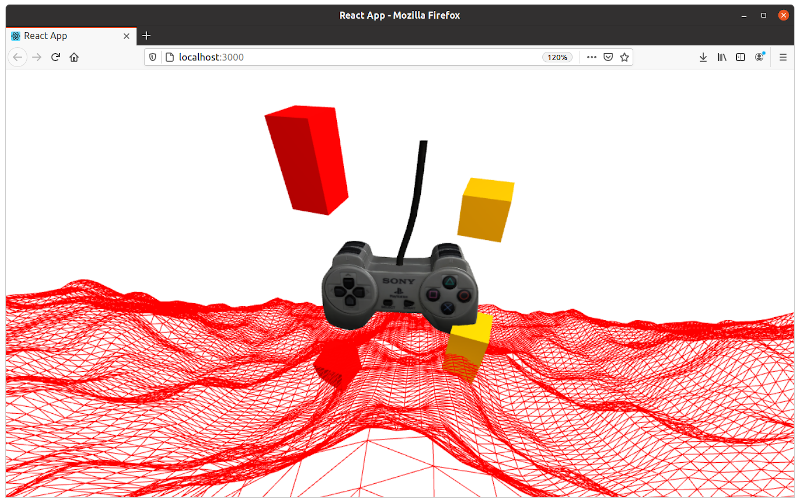

### ThreeJS con React

* **ThreeJS**. Librería para generar y animar gráficos 3D en el navegador, con WebGL.

    * Renderizadores (WebGL/Canvas), escenas, luces, sombras, materiales, texturas, objetos, geometrías, cargadores de datos.
    * Efectos, animaciones, shaders, exportación e importación de objetos, soporte, ejemplos, depuración.
    * Creative coding (arte+diseño+programación+matemáticas), visualización de datos, ui, juegos (pequeños).

* **React Three Fiber (R3F)**. Renderer/reconciliador de REact para ThreeJS.

    * Reconciliador = Algoritmo para re-renderizar el odm real a partir del dom virtual.
    * Canvas
        * escena(s)
            * Luz(ces)
            * Cámara
            * Objeto(s)
    * Objeto = _mesh_ = _geometry_ + _material_
        * Geometry: Sphere, Box, Cone, Cylinder, etc.
        * Material: Basic, Lambert, Phong, Normal, etc.

~~~
npx create-react-app threejs-react
cd threejs-react/
npm install three react-three-fiber
npm start

*Estructurar proyecto

npm install drei react-spring
~~~

GitHub (ver Ecosystem)

https://github.com/react-spring/react-three-fiber

~~~
npm install drei react-spring
~~~

El archivo.glb (igual a gltf) se genera a partir de un archivo.dae (modelo3d) y una textura.jpg (descargados de https://www.sketchup.com/es)

en la página: https://blackthread.io/gltf-converter/

